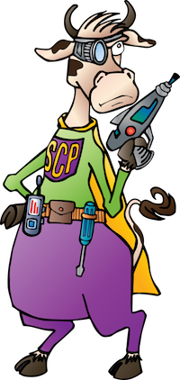

# SCP Labs
SCP Labs is the open source, community engagement team within the SuperCowPowers organization.

## Presentations

- Data Analysis, Machine Learning, Bro, and You!: <a href="https://www.youtube.com/watch?v=pG5lU9CLnIU" target="_blank">Presentation Video</a>

## Data Analysis Notebooks

- How to Optimize Clustering: <a href="https://nbviewer.jupyter.org/github/SuperCowPowers/scp-labs/blob/master/notebooks/Clustering_Picking_K.ipynb" target='_blank'>Clustering HyperParameters</a>
- Anomaly Detection Exploration: <a href="https://nbviewer.jupyter.org/github/SuperCowPowers/scp-labs/blob/master/notebooks/Anomaly_Detection.ipynb" target='_blank'>Anomaly Detection</a>
- Encoding Categorical Data: <a href="https://nbviewer.jupyter.org/github/SuperCowPowers/scp-labs/blob/master/notebooks/Categorial_Encoding.ipynb" target='_blank'>Categorical Variables</a>

 

  
### About SuperCowPowers
The company was formed so that its developers could follow their passion for Python, streaming data pipelines and having fun with data science. We also think cows are cool and should be superheros or at least carry around rayguns and burner phones. <a href="https://www.supercowpowers.com" target='_blank'>Visit SuperCowPowers</a>
    
    