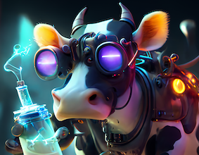

# SCP Labs
SCP Labs is the open source, community engagement team within the SuperCowPowers organization. Our mission is to provide useful software, notebooks, and examples around Data Science, Analysis, and Pipeline Processing. If you're interesting in our AWS SageMaker project please see [SageWorks](https://github.com/SuperCowPowers/sageworks).

## Presentations

- Data Analysis, Machine Learning, Bro, and You! : <a href="https://www.youtube.com/watch?v=pG5lU9CLnIU" target="_blank">Presentation Video</a>

## Data Analysis Notebooks

- Categorical Data Guide: [Guide to using Categorical Data](https://nbviewer.jupyter.org/github/SuperCowPowers/scp-labs/blob/main/notebooks/Categorical_Data_Guide.ipynb)
- Categorical Encoding Dangers!: [Categorical Data, ML, and Danger!](https://nbviewer.jupyter.org/github/SuperCowPowers/scp-labs/blob/main/notebooks/Categorical_Encoding_Dangers.ipynb)
- How to Optimize Clustering: [Clustering HyperParameters](https://nbviewer.jupyter.org/github/SuperCowPowers/scp-labs/blob/main/notebooks/Clustering_Picking_K.ipynb)
- Anomaly Detection Exploration: [Anomaly Exploration](https://nbviewer.jupyter.org/github/SuperCowPowers/scp-labs/blob/main/notebooks/Anomaly_Exploration.ipynb)
- Regression Evaluation Metrics: [Regression Model Metrics](https://nbviewer.jupyter.org/github/SuperCowPowers/scp-labs/blob/main/notebooks/Regression_Evaluation_Metrics.ipynb)

 

  
### About SuperCowPowers
The company was formed so that its developers could follow their passion for Python, streaming data pipelines and having fun with data science. We also think cows are cool and should be superheros or at least carry around rayguns and burner phones. <a href="https://www.supercowpowers.com" target="_blank">Visit SuperCowPowers</a>
    
    